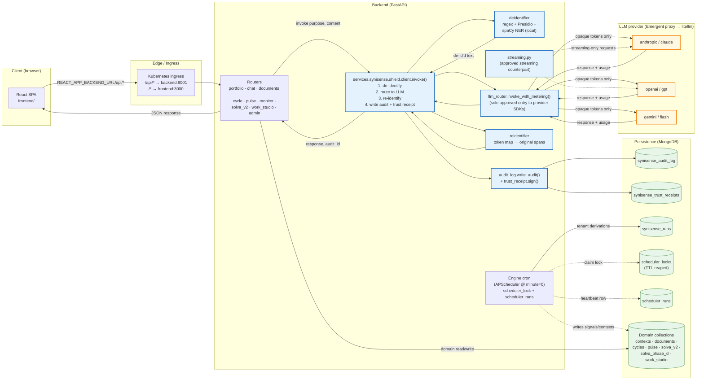

# AKKI Architecture — System Overview

**Document type**: Bank-QA reviewer companion (C19-002)
**Audience**: Technical assessor doing a one-page system review
**Anchor**: `/app/memory/product/AKKI_FEATURES_AND_FUNCTIONALITY.md` § 3 for the prose version of this picture.

The diagram below is rendered in Mermaid (live in any GitHub Markdown
viewer, in the Mermaid Live Editor, or via `npx mmdc`). For static
review environments, a rendered PNG sits next to this file at
`architecture_diagram.png` — regenerate with the same Mermaid source
if the diagram drifts.

## Request flow — Shield gateway end-to-end

## What the colour groups mean

- **Blue** — the Synisense Shield. The ONLY path that touches raw consumer text + provider SDKs. CI guards (`test_no_direct_llm_calls_outside_shield` + `test_no_direct_llm_calls_inside_shield_except_router`) enforce this.
- **Yellow** — outside the trust boundary. The LLM provider sees only de-identified tokens.
- **Green** — persistence. Audit, receipt, scheduler heartbeat, and domain data all sit here.

## Verification of the picture from outside

Three surfaces let a reviewer poke this architecture without reading code:

| Surface | What it confirms |
|---------|------------------|
| `GET /api/admin/synisense/observability?window_days=7` | Audit log is populated; per-consumer rates make sense. |
| `GET /api/admin/synisense/billing?window_days=7` | Cost roll-up uses the per-model rate table; estimated vs exact metering split visible. |
| `GET /api/admin/synisense/cron-health` (Chunk 19, C19-005) | Engine cron actually ran; per-job last-run timestamp visible. |
| `verify_trust_receipt.py --self-test` | HMAC chain on any saved receipt is reproducible with stdlib only. |

## What is NOT shown (deliberately)

- The frontend internals (component tree, state management). Read the `frontend/src/components/` directory for that — the diagram stops at the SPA box on purpose.
- The Presidio internals. Black-box from the diagram's viewpoint; the relevant invariant is "no raw text leaves the Shield".
- The Trust Receipt signing key rotation flow. Out of scope for the system-overview slide; lives in operator runbooks.

---

**Last regenerated**: 2026-05-21 (Chunk 19 close).
**To regenerate the PNG**: paste the Mermaid block into `https://mermaid.live`, export as PNG at 2× resolution, save next to this file as `architecture_diagram.png`.
